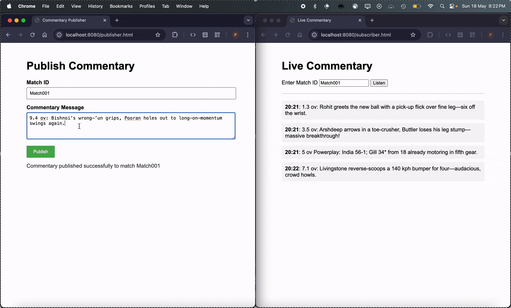

# Real-Time Commentary Broadcasting System 🚀

A real-time commentary delivery system built with Java, Spring Boot, Kafka, and Redis, using WebSockets for live user interaction.

 

## Features
- **Real-time updates** via WebSockets (STOMP protocol).
- **Kafka** for message streaming.
- **Redis** for storing commentary in chronological order (sorted by timestamp).
- **Web-based UI** for publishing/subscribing to commentary.
- **Historical data API** to fetch past commentary.
- **Auto-expiry** of Redis keys (30 minutes TTL).

## Tech Stack
- **Backend**: Java 17, Spring Boot 3.5, Spring WebSocket, Spring Kafka
- **Data Layer**: Redis (ZSet for ordered storage)
- **Messaging**: Apache Kafka
- **Frontend**: HTML/CSS/JavaScript (SockJS + Stomp.js)
- **Build Tool**: Maven

## System Architecture

## Getting Started

### Prerequisites
- Java
- Apache Kafka (running on localhost:9092)
- Redis (running on localhost:6379)
- Maven

### Installation
1. Clone the repository:
```bash
git clone https://github.com/princepatel2508/commentary-broadcast-system.git
cd commentary-broadcast-system
```

2. Start Kafka and Redis:
- Follow Kafka Quickstart (https://kafka.apache.org/quickstart) to start a Kafka broker
- Start Redis server

3. Build and Run:
```bash
mvn clean install
mvn spring-boot:run
```

4. Access UIs:
- Publisher: http://localhost:8080/publisher.html
- Subscriber: http://localhost:8080/subscriber.html
- Note: This HTML files (publisher.html and subscriber.html) are located in src/main/resources/static/.


### API Endpoints
| Endpoint                | Method | Description                          |
|-------------------------|--------|--------------------------------------|
| /api/commentary         | POST   | Publish new commentary               |
| /api/commentary/history | GET    | Fetch historical commentary by match |


- Example POST Request:
```json
{
"matchId": "Match123",
"message": "Dhoni hits a SIX!",
"timestamp": 1698765432000
}
